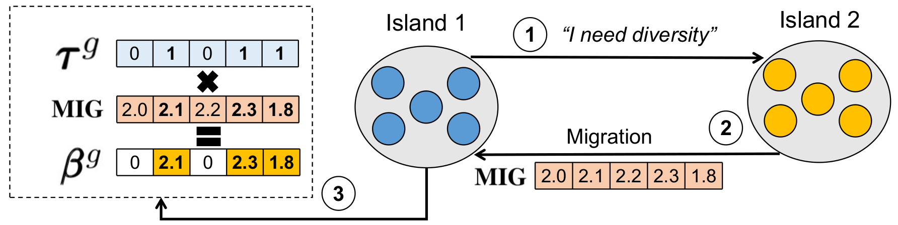

## 1. How to build the project

#### 1.1. Important comments before building the project

To compile this project you need to have OpenMPI (version 2.1.+ or later), GCC (version 7.5.0 or later) and GNU Make (version 4.1 or later) installed on you computer.

#### 1.2. Building the project

Inside the root directory of the project (`S1_S2_FIX_PROB/`), run the following commands:

```
make
```

## 2. Running the project

Inside the `S1_S2_FIX_PROB/` directory, you can find a shell script `run.sh` that performs the same experiment described in the PhD qualification. To run it, after compiling the project (as described in the previous section) and inside the `S1_S2_FIX_PROB/` directory, run the following command:

```
./run 
```  


## 3. Parameters description

After build the project, you can specify four paramenters when executing the `run.sh` script. 

```
./run $1 $2 $3 $4 $5
```  

The complete list of parameters is given below.


`$1`  
Number of islands: this value depends on the number of cores available on your system.

`$2`  
Dimension: number of variables. Valid values are:
* `10`
* `30`
* `50`
* `100`

`$3`  
Function: benchmark function to be solved. Valid values are: `1-30`

`$4`  
Number of runs: number of times that function is called.

`$5`  
Migration strategy: Valid values are:
* `0`: S1 strategy.
* `1`: S2 strategy.
* `2`: FIX strategy.
* `3`: PROB strategy.

If you do not provide any arguments, the default values are set as follows:

```
$1 = 4

$2 = (50, 100)

$3 = (1, 2, ..., 30)

$4 = 1

$5 = (0,1,2,3)
```  


## 4. Strategies description

### S1

The first strategy is the most straightforward. Figure below illustrates this approach. 



Consider that Island 1 identifies the need to diversify according to some of the rules presented in the previous section. In this case, it sends the message "I need diversity" to the Island 2 (step 1). Island 2 then responds by sending its best individual after receiving the message (step 2).

When Island 1 receives the best individual (**MIG**), it selects the values in the dimensions that should be diversified considering the $\pmb{\tau}^{g}$ vector. This can be done by extracting the positions of the vector $\tau^{g}$ containing the value equal to 1 and selecting through the indices the corresponding values in the **MIG** vector or even multiplying the vector $\pmb{\tau}^{g}$ by the **MIG** vector (step 3). The most efficient method depends on the CPU and compiler architecture. This new individual ($\pmb{\beta}^{g}$) is then integrated into the population replacing a random individual. For computing $\pmb{\beta}^{g}$, the computational complexity is $O(D)$. But, this is done only when a migration occurs.